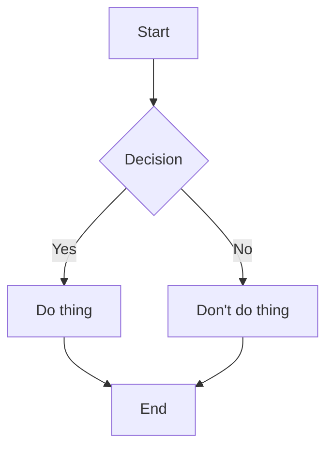
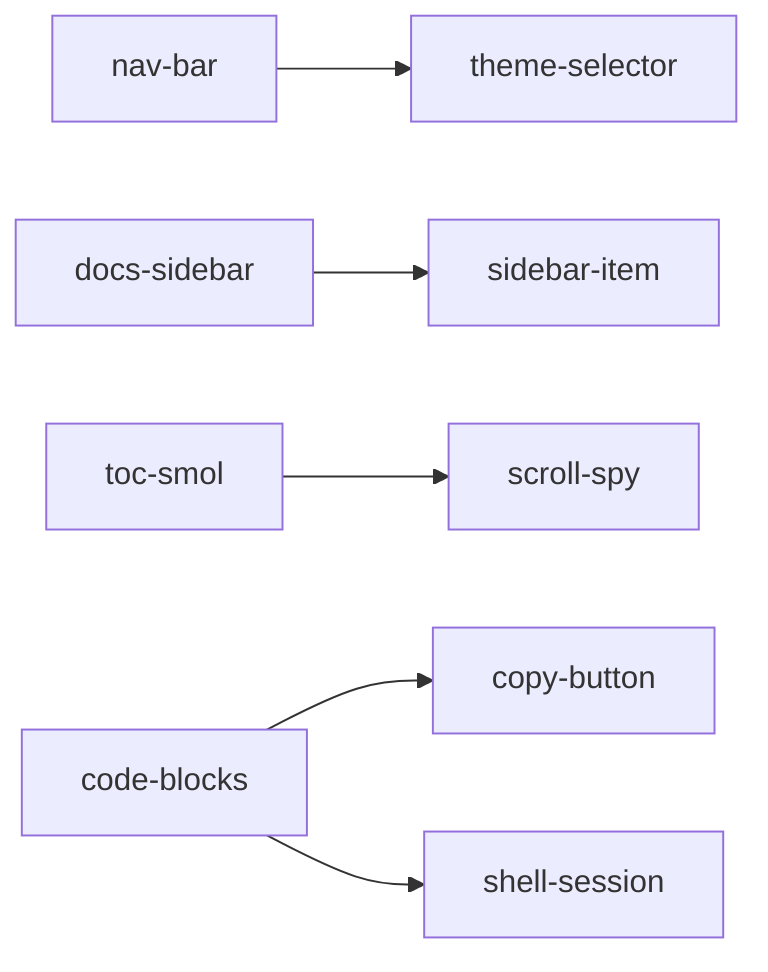

import PkgMeta from 'src/components/PkgMeta.astro';

# astro-mermaid-renderer-cli-smol

An Astro integration that pre-renders Mermaid diagrams to inline SVG at build time.
No client-side JavaScript is shipped -- diagrams are static SVG in the output HTML.

<PkgMeta pkg="astro-mermaid-renderer-cli-smol" />

## Installation

```shell-session
npm install astro-mermaid-renderer-cli-smol mermaid
```

## Setup

In `astro.config.ts`:

```ts
import mermaidSSR from 'astro-mermaid-renderer-cli-smol';

export default defineConfig({
  integrations: [
    mermaidSSR({
      theme: 'default',
    }),
  ],
});
```

## Options

| Option | Type | Default | Description |
|--------|------|---------|-------------|
| `theme` | `string` | `'default'` | Mermaid theme: `default`, `dark`, `neutral`, `forest` |
| `titleFix` | `boolean` | `true` | Strip title from rendered SVG (prevents duplicate headings) |
| `injectCSS` | `boolean` | `true` | Auto-inject default styles |
| `securityLevel` | `string` | `'loose'` | Mermaid `securityLevel` setting |

## Usage in MDX

Write standard Mermaid fences in your MDX files:

````md

````

## Live example



## How it works

The integration registers a remark plugin (`remarkMermaidSSR`) that transforms
` ```mermaid ` fences into inline SVG during the Astro build. It uses `svgdom`
to render Mermaid server-side without a headless browser.

To use the remark plugin directly without the integration:

```ts
import { remarkMermaidSSR } from 'astro-mermaid-renderer-cli-smol';

export default defineConfig({
  markdown: {
    remarkPlugins: [[remarkMermaidSSR, { theme: 'neutral' }]],
  },
});
```
