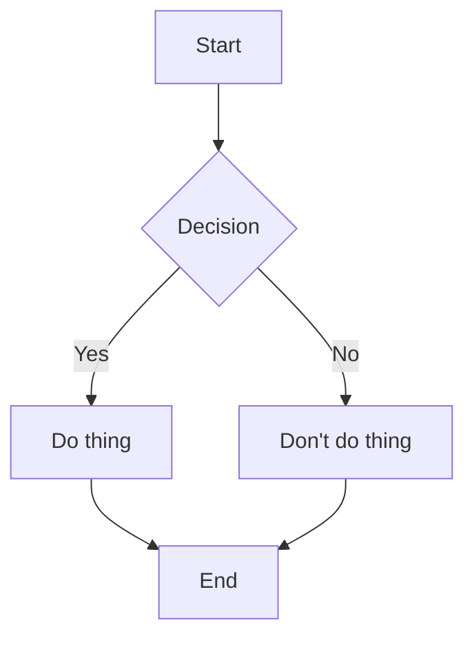
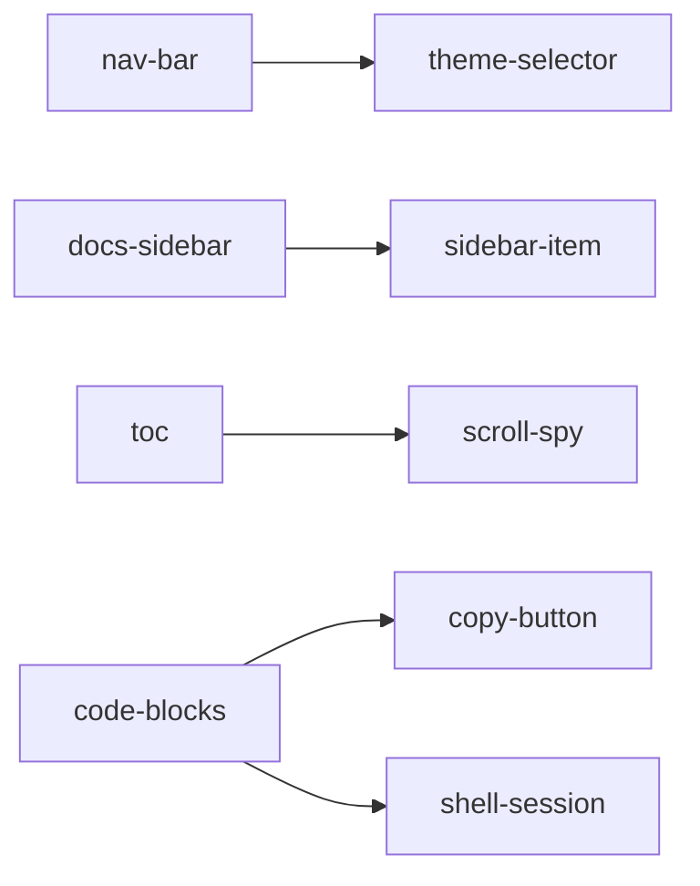

import PkgMeta from 'src/components/PkgMeta.astro';

An Astro integration that pre-renders Mermaid diagrams to inline SVG at build time.
No client-side JavaScript, because diagrams are static SVG in the output HTML.
No heavyweight browser CLI required, either, because this uses `svgdom` (just a few MBs, a couple of orders of magnitude lighter than Playwright) to render SVGs.

<PkgMeta pkg="astro-better-mermaid" />

## Installation

```shell-session
npm install astro-better-mermaid mermaid
```

## Setup

In `astro.config.ts`:

```ts
import mermaidSSR from 'astro-better-mermaid';

export default defineConfig({
  integrations: [
    mermaidSSR({
      theme: 'default',
    }),
  ],
});
```

## Options

| Option | Type | Default | Description |
|--------|------|---------|-------------|
| `theme` | `string` | `'default'` | Mermaid theme: `default`, `dark`, `neutral`, `forest` |
| `titleFix` | `boolean` | `true` | Strip title from rendered SVG (prevents duplicate headings) |
| `injectCSS` | `boolean` | `true` | Auto-inject default styles |
| `securityLevel` | `string` | `'loose'` | Mermaid `securityLevel` setting |
| `cache` | `boolean` | `true` | Cache rendered diagrams on disk between builds |
| `cacheDir` | `string` | `'node_modules/.cache/astro-better-mermaid'` | Where cached diagrams live, relative to the working directory |

## Usage in MDX

Write standard Mermaid fences in your MDX files:

````md

```mermaid
graph TD
  A[Start] --> B{Decision}
  B -->|Yes| C[Do thing]
  B -->|No| D[Don't do thing]
  C --> E[End]
  D --> E
```
````

## Live example


```mermaid
graph LR
  nav-bar --> theme-selector
  docs-sidebar --> sidebar-item
  toc --> scroll-spy
  code-blocks --> copy-button
  code-blocks --> shell-session
```

## How it works

The integration registers a remark plugin (`remarkMermaidSSR`) that transforms
` ```mermaid ` fences into inline SVG during the Astro build. It uses `svgdom`
to render Mermaid server-side without a headless browser.

To use the remark plugin directly without the integration:

```ts
import { remarkMermaidSSR } from 'astro-better-mermaid';

export default defineConfig({
  markdown: {
    remarkPlugins: [[remarkMermaidSSR, { theme: 'neutral' }]],
  },
});
```

## Caching

Rendering a diagram is the slow part, so the plugin caches each rendered diagram on disk and reuses it on later builds. Entries are keyed by the Mermaid version, the theme and security level, and the diagram source, so editing a diagram or upgrading Mermaid renders it again. Diagrams that fail to render are never cached.

Each diagram's SVG id comes from its position on the page and a hash of its source, so the same page builds to the same HTML every time. Earlier versions used a random id.

Set `cache: false` to turn the disk cache off, or point `cacheDir` somewhere that persists between CI runs to share it.

## Use with Sätteri

When `markdown.processor` is a Sätteri processor, the integration adds its Sätteri plugins to that processor instead of registering remark plugins. Nothing else in the setup changes:

```ts title="astro.config.ts"
import mdx from '@astrojs/mdx';
import { satteri } from '@astrojs/markdown-satteri';
import mermaidSSR from 'astro-better-mermaid';

const processor = satteri();

export default defineConfig({
  markdown: { processor },
  integrations: [mdx({ processor }), mermaidSSR({ theme: 'neutral' })],
});
```

Pass the same processor to `mdx()`, as above, so MDX files get the plugins too.

To wire the plugins yourself, import them from `astro-better-mermaid/satteri`. They take the same options as the remark plugins:

```ts
import { mermaidTitle, mermaidSSR } from 'astro-better-mermaid/satteri';

const processor = satteri({
  // mermaidTitle first, as with mermaidTitleFix and remarkMermaidSSR
  mdastPlugins: [mermaidTitle(), mermaidSSR({ theme: 'neutral' })],
});
```

Without the integration, keep `svgdom` and `mermaid` in `vite.ssr.external` and import `astro-better-mermaid/styles.css` in your layout, as the integration would.
